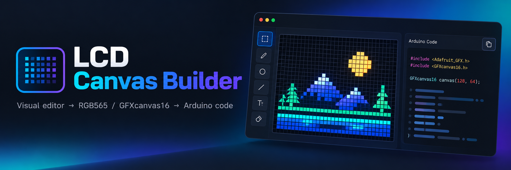

# LCD Canvas Builder

Визуальный редактор интерфейсов для маленьких TFT-дисплеев на Adafruit GFX. Рисуешь фигуры и текст мышкой на холсте нужного размера, а редактор сразу выдаёт готовый C++-код для `GFXcanvas16`.

Изначально сделан под плату **Waveshare ESP32-S3-LCD-1.47B** (ST7789, 172 × 320), но размер холста настраивается под любой экран: есть заготовки популярных дисплеев и кнопка смены ориентации.

---

## Возможности

- **Превью пиксель в пиксель.** Линии, круги, скругления, заливка треугольников и вывод текста портированы из исходников Adafruit GFX. На холсте получается ровно то, что окажется на экране.
- **Цвета RGB565.** Любой цвет сразу приводится к 16-битному формату дисплея. Его можно вводить как `0xF800`, `#ff0000` или по имени (`RED`, `ST77XX_RED`).
- **Фигуры:** прямоугольник, скруглённый прямоугольник, круг, линия, треугольник, пиксель. У каждой фигуры есть варианты `draw` (контур) и `fill` (заливка).
- **Текстовые блоки** с переносом по словам, выравниванием по горизонтали и вертикали и выбором шрифта.
- **Шрифты:** встроенный 5×7, все FreeFonts (Sans / Mono / Serif, 9–24pt, обычные, жирные и курсивные) и пиксельные Picopixel, TomThumb, Org_01, Tiny3x3.
- **Ручки изменения размера** на углах и сторонах, причём ручка на стороне меняет размер только по одной оси.
- **Привязка с направляющими.** При перемещении, изменении размера и рисовании края и центры прилипают к краям и центру экрана и других фигур. С зажатым `Ctrl/⌘` привязка отключается.
- **Выделение нескольких фигур** (Shift+клик, рамка), групповое перемещение, удаление, копирование, смена цвета и выравнивание внутри выделения, включая равные промежутки.
- **Слои и группы:** имена, скрытие, блокировка, порядок перетаскиванием, вложенные группы.
- **Несколько экранов** — вкладки над холстом; каждый экран становится функцией `void drawИмя()`.
- **Картинки и иконки** (PNG / JPG / SVG): массив RGB565 для `drawRGBBitmap` (с маской прозрачности) или 1-битная иконка для `drawBitmap`. Превью рисуется из тех же массивов, что уйдут в код.
- **Меняющийся текст** — блок превращается в функцию `drawTemp(const char* value)`, которая стирает область и выравнивает значение на плате через `getTextBounds`.
- **Градиенты и сглаживание:** линейные под любым углом и радиальные, до 4 цветов, с дизерингом — для фигур, иконок и текста; сглаженные края у скруглённых прямоугольников, кругов, линий, треугольников и текста своими шрифтами. На плате получается то же, что в превью, пиксель в пиксель.
- **Анимации ключевыми кадрами** — таймлайн под холстом: двигаешь фигуру с включённой записью, и получаются ключи. Плавно меняются координаты, размеры, радиус и цвет (в том числе цвета градиента), скачком — видимость и текст. Режимы: цикл, туда-обратно, один раз по `startИмя()`, по значению через `setИмя(v)`. На плате анимация неблокирующая: `tickЭкран(millis())` (или общий `lcbTick`, если экранов несколько) в `loop()`, кадры совпадают с превью пиксель в пиксель.
- **Поворот и непрозрачность.** Прямоугольники, линии, треугольники, картинки и спрайты поворачиваются вокруг оси, которую можно тянуть на холсте; скруглённый прямоугольник, круг и пиксель поворачиваются как точка. Непрозрачность 0–255 есть у любого элемента. Угол, ось и непрозрачность анимируются.
- **Спрайты** — покадровая анимация: кадры из картинок, иконок или групп фигур, у каждого кадра своя длительность, режимы те же, что у анимаций. Спрайт получается из выделения, из нескольких файлов сразу или из анимированного GIF. Кадры в коде — массивы `PROGMEM`.
- **Готовые эффекты:** мигание, пульс (размер или цвет), бегущая строка в рамке текста, спиннер, прогресс-бар по значению. Эффект — это обычная анимация с ключами, её можно доправить вручную.
- **Графики и диаграммы** (`G`): линия, область, столбцы, круговая. Рисуются по массиву данных: в скетче — `int16_t имяData[N]`, `pushИмя(v)` добавляет новое значение, `drawИмяChart()` перерисовывает. Превью по примеру данных совпадает с платой пиксель в пиксель.
- **Менеджер экранов и переходы.** Если экранов несколько, скетч получает `enum Screen`, `goTo(SCR_…)` и общий `lcbTick(millis())`. Переходы: мгновенный, сдвиг и шторка в четыре стороны, затухание через цвет, с плавностью. Переход на экран задаётся на его вкладке и проигрывается в редакторе — на холсте и на плате.
- **Живое превью на плате** по USB через Web Serial: каждое изменение сразу появляется на настоящем экране.
- **Кириллица:** шрифт TTF/OTF превращается в GFXfont (CP1251) прямо в браузере, вместе с хелпером `cp1251()` для скетча.
- **Имена в коде:** комментарии `// имя` и, по желанию, константы координат `constexpr int BTN_OK_X = …;`.
- **Палитра проекта:** именованные цвета `constexpr uint16_t C_… = 0x….;`. Если поменять цвет в палитре, он поменяется у всех фигур, которые на него ссылаются.
- **Выравнивание по экрану:** к краям, по центру по каждой оси и точно в центр.
- **Измерение расстояний.** С зажатым Option (Alt) показываются отступы в пикселях до краёв экрана или до другой фигуры.
- **Импорт кода.** Можно вставить готовые вызовы `canvas.*` и продолжить редактировать их визуально. Текст тоже распознаётся.
- **Удобства:** отмена и повтор, копирование и вставка, дублирование, порядок слоёв, точный ввод координат, автосохранение в браузере.
- **Подсказка на пустом холсте** — с чего начать; пропадает с первой фигурой.

---

## Запуск

Редактор — обычная веб-страница без сборки и зависимостей. Шрифты Adafruit GFX лежат рядом в `fonts.js`.

1. Открой `index.html` в браузере (Chrome, Safari, Firefox) прямо с диска, через `file://` — сервер не нужен.
2. Рисуй.
3. Нажми **«Копировать»** и вставь код в скетч.

Состояние холста хранится в `localStorage` браузера и восстанавливается при следующем открытии.

**Живое превью на плате** работает и с `file://`: Web Serial доступен в Chrome и Edge на компьютере, а `file://` считается безопасным контекстом (проверено в Chrome 154). Если твой браузер всё же не даёт выбрать порт со страницы `file://`, открой редактор через локальный сервер:

```sh
python3 -m http.server 8000
# и открой http://localhost:8000/
```

В Safari и Firefox Web Serial нет — там работает всё, кроме подключения платы.

---

## Базовый шаблон скетча

В режиме **«весь скетч»** редактор выдаёт полный файл по этому шаблону, а в режиме **«фигуры»** — только строки рисования текущего экрана для вставки вместо `// ... рисуем здесь ...`.

```cpp
#include <Waveshare_LCD147.h>
#include <Adafruit_GFX.h>

constexpr int W = 172;   // ширина экрана
constexpr int H = 320;   // высота экрана

St7789* lcd;                 // драйвер
GFXcanvas16 canvas(W, H);    // холст в памяти, на нём рисуем

// Показать холст на экране
void present() {
  lcd->drawImage(0, 0, W, H, canvas.getBuffer());
}

// Экран «Main»
void drawMain() {
  canvas.fillScreen(0x0000);  // фон
  // ... рисуем здесь ...
}

void setup() {
  Serial.begin(115200);
  lcd = &Waveshare147::begin();

  drawMain();
  present();
}

void loop() {
}
```

Что ещё добавляется в шапку, если оно есть в макете (в таком порядке):

- `#include <Fonts/…>` для используемых FreeFonts;
- `#include "images.h"`, если картинки вынесены в отдельный файл;
- константы палитры и константы координат;
- массивы картинок (`PROGMEM`) — после `canvas`, выше `setup()`;
- функции меняющегося текста — после `present()`;
- по функции `void drawИмя()` на каждый экран. `setup()` вызывает первый экран, в `loop()` появляется закомментированный пример обновления меняющегося текста.

> **Изменение формата с этапа 2.** Раньше рисование стояло прямо в `setup()`; теперь оно в функции экрана. Импорт понимает оба варианта.

---

## Управление

### Инструменты

| Клавиша | Инструмент | Как рисовать |
|---|---|---|
| `V` | Выбор | Клик выбирает (фигуру в группе — вместе с группой), двойной клик — саму фигуру. `Shift`+клик добавляет или убирает, рамка по пустому месту выделяет несколько. Перетаскивание двигает, ручки меняют размер |
| `R` | Прямоугольник | Тянуть от угла до угла. `Shift` — квадрат. Клик ставит 40×30 |
| `O` | Скруглённый прямоугольник | Как прямоугольник, радиус задаётся в панели |
| `C` | Круг | Нажать в центре и тянуть наружу на длину радиуса |
| `L` | Линия | Тянуть от начала до конца. `Shift` — строго по горизонтали или вертикали |
| `Y` | Треугольник | Три клика — три вершины |
| `P` | Пиксель | Клик |
| `T` | Текст | Тянуть рамку блока или кликнуть |
| `G` | График или диаграмма | Тянуть рамку или кликнуть (120×60). Вид, данные и диапазон — в панели фигуры |
| `I` | Картинка | Открывает выбор файла. Ещё можно перетащить файл на холст или вставить картинку из буфера (`Ctrl/⌘ + V`). Несколько файлов сразу или анимированный GIF дают спрайт |

### Горячие клавиши

| Клавиша | Действие |
|---|---|
| `F` | Переключить контур / заливку |
| `←` `→` `↑` `↓` | Сдвинуть выделение на 1 px (`Shift` — на 10 px) |
| `Ctrl/⌘` (удерживать при перетаскивании) | Временно отключить привязку |
| `Ctrl/⌘` + колесо, щипок на трекпаде | Масштаб вокруг курсора. Обычное колесо прокручивает увеличенный холст |
| `Ctrl/⌘ + A` | Выделить все видимые незаблокированные фигуры |
| `Ctrl/⌘ + G` | Сгруппировать выделение |
| `Ctrl/⌘ + Shift + G` | Разгруппировать |
| `Option` / `Alt` (удерживать) | Показать расстояния до краёв и до фигуры под курсором |
| `Delete` / `Backspace` | Удалить выделение |
| `Ctrl/⌘ + D` | Дублировать |
| `Ctrl/⌘ + C` | Копировать выделение во внутренний буфер (группы, выделенные целиком, копируются как группы) |
| `Ctrl/⌘ + X` | Вырезать выделение |
| `Ctrl/⌘ + V` | Вставить. Копия ставится со сдвигом +5/+5, каждая следующая вставка — ещё на +5. После «Вырезать» первая вставка встаёт на старое место |
| `Пробел` | Проиграть / остановить открытую анимацию |
| `Delete` / `Backspace` после клика по таймлайну | Удалить выбранные ключи (а не фигуры) |
| `←` `→` после клика по таймлайну | Сдвинуть выбранные ключи на 10 мс (`Shift` — на 100 мс) |
| `Ctrl/⌘ + A` после клика по таймлайну | Выбрать все ключи открытой анимации |
| `Ctrl/⌘ + C`, `Ctrl/⌘ + V` после клика по таймлайну | Копировать выбранные ключи и вставить их на бегунок |
| `Shift` + клик по ключу | Добавить ключ к выбранным |
| Рамка по пустому месту таймлайна | Выбрать ключи, которых она касается (`Shift` — добавить к выбранным) |
| `Alt` при перетаскивании ключа или бегунка | Без шага 10 мс и без прилипания |
| `Ctrl/⌘ + Z` | Отменить |
| `Ctrl/⌘ + Shift + Z`, `Ctrl + Y` | Повторить |
| `Esc` | Снять выделение / отменить треугольник |
| Двойной клик по тексту | Перейти к редактированию текста |

Горячие клавиши с `Ctrl/⌘` работают при любой раскладке клавиатуры.

Если кликнуть по строке в панели кода, выделится фигура, которую эта строка рисует.

### Панели

- **Подсказка** под холстом — одна строка; целиком её видно при наведении.
- **Размеры.** Границу между холстом и правой панелью, верхний край таймлайна и нижний край списка слоёв и панели кода можно тянуть мышью — при наведении на границе появляется синяя линия.
  - Правая панель уже 220 px сворачивается в узкую полосу; `‹` на полосе или двойной клик по границе разворачивает её обратно с прежней шириной.
  - Таймлайн ниже 70 px сворачивается (как кнопкой ▾); двойной клик по границе сворачивает или разворачивает.
  - Двойной клик по нижней границе списка слоёв или кода возвращает обычную высоту.
- **Секции правой панели** («Цвет», «Фигура», «Слои», «Плата», «Код») сворачиваются кликом по заголовку.
- Размеры и свёрнутые секции сохраняются вместе с проектом. На узком экране (меньше 980 px) панели идут одна под другой, и размеры не меняются.
- **Область в фокусе** — холст, таймлайн или секция правой панели, по которой кликнули последней, — обведена синей рамкой. Клавиши работают в ней: например, после клика по таймлайну `Delete`, стрелки и `Ctrl/⌘ + A` относятся к ключам, а не к фигурам.

---

## Экран

- **Заготовки** в шапке: 172×320 (Waveshare 1.47″), 135×240 (1.14″), 240×240 (1.3″/1.54″), 240×280 (1.69″), 240×320 (2.0–2.8″), 320×480 (3.5″), 128×160 (1.8″), 128×128. Заготовка применяется в текущей ориентации.
- **Масштаб** — список «Масштаб» в шапке или `⌘/Ctrl` + колесо (щипок на трекпаде) над холстом. Масштаб целый (×1…×32), чтобы пиксели оставались квадратными. Максимум ограничен размером холста в браузере (около 8192 px по большей стороне): для 172×320 это ×24 на обычном экране и ×12 на Retina. Точка под курсором остаётся на месте, когда холст больше окна; пока он помещается в окно, он стоит по центру. Увеличенный холст прокручивается колесом, двумя пальцами или полосами прокрутки. «авто» снова вписывает холст в окно.
- **«⟲ ориентация»** меняет местами W и H. В коде меняются только `W` и `H` в шаблоне, фигуры остаются на своих координатах.

## Экраны

- Вкладки над холстом: клик — переключиться, двойной клик — переименовать, `⚙` — настройки экрана, `+` — новый экран, `⧉` — дублировать, `×` — удалить (отменяется через `Ctrl/⌘ + Z`).
- У каждого экрана свои фигуры, группы и фон. Палитра, размер экрана и настройки общие.
- **Настройки экрана** — в правой панели, когда ничего не выбрано (клик по пустому месту холста, `Esc` или `⚙` на вкладках): раздел «Фигура» становится «Экран «Имя»» с **фоном экрана** и **переходом** на него.
- В коде каждый экран — функция `void drawИмя()` с `fillScreen` и фигурами. Имя функции получается из имени экрана: «Main» → `drawMain`, «Настройки» → `drawNastroyki` (кириллица транслитерируется).
- Если экранов несколько, каждый экран сам задаёт шрифт, размер и цвет текста, а не полагается на то, что осталось от другого.
- Режим «фигуры» показывает только текущий экран. Буфер обмена работает между экранами.

### Экраны и переходы

Если экранов два или больше, режим «весь скетч» добавляет менеджер экранов. В `loop()` остаётся один вызов:

```cpp
void loop() {
  lcbTick(millis());  // текущий экран с анимациями или кадр перехода
  // goTo(SCR_SETTINGS);  // на «Settings»: сдвиг влево, 300 мс
}
```

- **Экраны** — `enum Screen : uint8_t { SCR_MAIN, SCR_SETTINGS, … }` по именам вкладок.
- **`goTo(SCR_…)`** переходит на экран его переходом по умолчанию. **`goTo(SCR_…, LCB_T_…, мс)`** и **`goTo(SCR_…, LCB_T_…, мс, LCB_E_…, цвет)`** — любым другим.
- **`lcbTick(millis())`** рисует текущий экран и вызывает `present()`. Экран с анимациями перерисовывается каждый кадр, экран без анимаций — только когда его показали или вызвали `lcbRedraw()`. Во время перехода `lcbTick` рисует кадр перехода.
- **Переходы:**

  | Вид | Код | Что происходит |
  |---|---|---|
  | мгновенно | `LCB_T_NONE` | новый экран сразу |
  | сдвиг влево / вправо / вверх / вниз | `LCB_T_SLIDE_LEFT` … `_DOWN` | оба экрана едут: новый въезжает справа / слева / снизу / сверху |
  | шторка влево / вправо / вверх / вниз | `LCB_T_WIPE_LEFT` … `_DOWN` | старый стоит, новый открывается от правого / левого / нижнего / верхнего края |
  | затухание через цвет | `LCB_T_FADE` | первая половина — старый экран темнеет к цвету, вторая — новый проявляется из него |

  У каждого перехода есть длительность и плавность (линейно, разгон, торможение, плавно). Анимации нового экрана во время перехода идут.
- **Память.** Сдвигу и шторке нужен второй буфер кадра — снимок старого экрана, `W × H × 2` байт (110 КБ для 172×320). Он выделяется один раз при первом таком переходе: через `ps_malloc`, если на плате есть PSRAM, иначе обычным `malloc`. Если памяти не хватило, переход становится мгновенным. Затуханию второй буфер не нужен: оно перерисовывает старый или новый экран и смешивает его с цветом.
- **Меняющийся текст** в менеджере всегда хранит значение в `String tempValue`: экран перерисовывается, когда его снова показывают. Новое значение — `tempValue = "24.1"; lcbRedraw();`.
- **Проект с одним экраном** генерируется как раньше: `drawMain()`, `tickMain(millis())`, без менеджера.

**Как настроить переход** (в настройках экрана, когда экранов больше одного):

1. Открой вкладку экрана, **на который** переходят, например «Settings», и сними выделение (или нажми `⚙` на вкладках).
2. В правой панели «Экран «Settings»» в поле **«Переход сюда»** выбери вид — по умолчанию «сразу, без перехода» — и, если нужно, длительность, плавность и цвет затухания. Подсказка под ним напоминает, что переход срабатывает при `goTo(SCR_SETTINGS)`.
3. Ниже появится блок **«проверить с экрана»**: выбери, **с какого** экрана идёт переход, и нажми **▶ проиграть** — переход покажется на холсте и, если плата подключена, на ней. Ползунок показывает любой момент перехода. Любая правка возвращает обычный вид холста.

Это переход **по умолчанию**: его делает `goTo(SCR_SETTINGS)`. В коде можно вызвать и любой другой: `goTo(SCR_SETTINGS, LCB_T_FADE, 400)`.

**Как обойтись без переходов:**
- переход «сразу, без перехода» — экран меняется мгновенно, второй буфер не нужен;
- галочка **«экраны через goTo()»** в разделе «Код» выключает менеджер целиком: скетч генерируется как раньше — каждый экран `drawИмя()`, экраны с анимациями — `tickИмя(now)`, а какой экран показывать, решает твой код. Поле «Переход сюда» тогда пишет, что переходов нет, и предлагает включить их обратно.

Проверено так: сгенерированный скетч с тремя экранами собирается на компьютере с настоящей Adafruit GFX, и для каждого вида перехода в разные моменты (с плавностью и без, с анимированным экраном, переходом по умолчанию и после окончания) кадры совпадают с превью редактора пиксель в пиксель. Под ESP32-S3 он собирается через `arduino-cli` без предупреждений.

## Имена в коде

- Если элемент или группу переименовать (имя не вида «Прямоугольник 3» / «Группа 2»), перед его строками в коде появляется комментарий `// имя`.
- Переключатель **«константы координат»** под заголовком «Код»: для переименованных элементов выводятся `constexpr int ИМЯ_X = …;` (`_Y`, `_W`, `_H`, `_R`, `_X0`… — по полям фигуры), а вызовы используют их. У текста курсор пишется относительно блока: `setCursor(ZAGOLOVOK_X + 3, ZAGOLOVOK_Y + 12)`.
- Имена превращаются в идентификаторы C++: кириллица транслитерируется, остальное заменяется на `_`, при совпадениях добавляется номер (`FON_2`).

## Картинки

- Добавить: кнопка «Картинка» (`I`) слева, перетаскивание файла на холст (картинка встанет под курсор) или вставка из буфера. Форматы — PNG, JPG, SVG (а также GIF и WebP). Картинка ставится в исходном размере или уменьшается, чтобы поместиться на экран.
- Если выбрать или перетащить **несколько файлов** сразу, получится спрайт: кадры идут в порядке имён файлов (`walk_2` раньше `walk_10`). **Анимированный GIF** тоже становится спрайтом — со своими кадрами и их длительностями (до 120 кадров; нужен Chrome или Edge, в других браузерах берётся первый кадр). Подробнее — в разделе «Спрайты».
- **Размер** меняется ручками или полями `w`/`h`. «Исходные пропорции» подгоняет высоту под пропорции файла.
- **Масштабирование:** «без сглаживания» берёт ближайший пиксель исходника, «усреднение» — среднее по области (с учётом прозрачности). SVG сначала растрируется в 4× размере, потом так же масштабируется.
- **Режим «цвет»:** массив `uint16_t` RGB565 и `canvas.drawRGBBitmap(x, y, имя, w, h)`. Если в картинке есть прозрачность (альфа < 128), добавляется маска `имя_mask` и используется перегрузка `drawRGBBitmap(x, y, имя, имя_mask, w, h)`.
- **Режим «иконка»:** 1-битный массив и `canvas.drawBitmap(x, y, имя, w, h, цвет)`. Пиксель горит, если его яркость (`0.299 R + 0.587 G + 0.114 B`) меньше порога; прозрачное считается белым. «Инверсия» меняет горящие и погасшие местами. Цвет — цвет фигуры, его можно взять из палитры.
- **Формат битов** как в Adafruit GFX: строки по `(w + 7) / 8` байт, старший бит — левый пиксель. Превью рисуется из этих же массивов тем же алгоритмом, что `drawBitmap` / `drawRGBBitmap`.
- **Массивы** называются по имени элемента (по умолчанию — имя файла), объявляются с `PROGMEM` и в режиме «весь скетч» идут выше `setup()`. В панели кода строки данных свёрнуты, кнопка «Копировать» копирует всё целиком.
- **«картинки в images.h»:** массивы уходят в отдельный файл, скетч получает `#include "images.h"`, а у переключателя режимов кода появляется вкладка `images.h` — её содержимое копируется той же кнопкой. Положи файл рядом со скетчем.
- Картинки хранятся в `localStorage` вместе с проектом. Большие растровые файлы ужимаются до 1024 px по большей стороне. Если место кончится, под холстом появится предупреждение.

## Меняющийся текст

- В панели текстового блока включи **«меняющийся текст»** и задай `id`, например `temp`. Текст блока становится примером значения (одна строка, без переносов).
- В скетче появляется функция:

```cpp
void drawTemp(const char* value) {
  canvas.fillRect(10, 40, 60, 30, 0x0000);  // стереть область блока
  canvas.setFont(&FreeSans9pt7b);
  canvas.setTextSize(1);
  canvas.setTextColor(0xFFFF);
  canvas.setTextWrap(false);
  // выравнивание считается на плате через getTextBounds
  int16_t bx, by; uint16_t bw, bh;
  canvas.getTextBounds(value, 0, 0, &bx, &by, &bw, &bh);
  canvas.setCursor(10 + (60 - bw) / 2 - bx, 40 + (30 - bh) / 2 - by);
  canvas.print(value);
}
```

- Функция экрана вызывает её с примером: `drawTemp("23.5");`. В `loop()` есть закомментированный пример обновления. После обновления не забудь `present()`.
- **Стирать** можно фоном экрана или своим цветом (в том числе из палитры).
- Превью считает `getTextBounds` так же, как библиотека: для встроенного шрифта `6 × size` на символ и высота `8 × size`, для GFXfont — по прямоугольникам глифов, включая пробелы. Целочисленное деление — как в C. Поэтому позиция в редакторе совпадает с позицией на плате. Вертикальное выравнивание идёт по фактическим границам значения, а не по метрикам шрифта, как у обычного текста.

## Градиенты и сглаживание

В панели элемента есть строка **«Заливка: цвет / градиент»** и галочка **«сглаживание»**.

**Градиент** — для прямоугольников, кругов, линий, треугольников (заливка и контур), иконок (картинка в режиме «иконка») и текста:
- **линейный** под любым углом (0° — слева направо, 90° — сверху вниз, кнопки ↓ → ↘ ↙ ← ↑) или **радиальный** — от центра рамки к краям, радиус равен половине большей стороны;
- **от 2 до 4 цветов** с позициями в процентах; цвет можно взять из палитры, ⇄ разворачивает градиент;
- **дизеринг** — упорядоченный 4×4: убирает полосы, которые иначе видны на плавных переходах в RGB565;
- градиент растягивается по рамке элемента, у текста — по рамке текстового блока.

**Сглаживание** — у скруглённого прямоугольника, круга, линии, треугольника и текста. Покрытие каждого пикселя края считается по 4×4 подвыборкам и смешивается с тем, что уже нарисовано под ним (`canvas.getPixel`). Края считаются геометрически: сглаженный круг радиуса r так же шириной 2r + 1, но набор пикселей не совпадает с несглаженным `fillCircle`. У прямоугольника края и так ровные — сглаживать нечего.

**Текст со сглаживанием** — только своими шрифтами из раздела «Шрифты с кириллицей»: генератор теперь сохраняет у каждого глифа ещё и 4-битную альфу. Шрифт, созданный до этой версии, пересоздай — иначе галочка недоступна. Встроенный 5×7 и FreeFonts однобитные, их можно только красить градиентом.

### Как это выглядит в коде

В Adafruit GFX нет ни градиентов, ни сглаживания, поэтому такие элементы рисуются своими функциями `lcb…`. Их код редактор кладёт в скетч (после `canvas`, перед `present()`), только если они используются; в панели кода он свёрнут, кнопка «Копировать» копирует целиком. Элементы без градиента и сглаживания по-прежнему идут как `canvas.*`.

```cpp
{ const LcbPaint p = { LCB_LINEAR, 0, 1024, 2, { 0xF800, 0x001F, 0, 0 }, { 0, 4096, 0, 0 }, false };
  lcbFillRect(5, 5, 160, 30, p); }
lcbFillCircle(120, 130, 30, lcbSolid(0x07FF), true);          // сглаженный круг одним цветом
lcbText(18, 62, cp1251("Привет"), &Arial12pt8b, 1, lcbSolid(0xFFFF), 10, 40, 150, 30, &Arial12pt8bAA);
```

- `LcbPaint`: вид, направление `(dx, dy) × 1024`, число цветов, цвета, позиции (0…4096), дизеринг. Последний аргумент фигур — сглаживание.
- `lcbText(x, y, строка, шрифт, размер, заливка, рамка блока x, y, w, h[, сглаженная копия шрифта])` печатает строку от курсора, как `print`; для встроенного шрифта — `lcbTextGlcd(…)` (в скетч тогда добавляется копия `glcdfont`, потому что в библиотеке он скетчу недоступен).
- Всё считается в целых числах одинаково в редакторе и на плате. Это проверено так: сгенерированный скетч компилируется на компьютере и его картинка сравнивается с превью — на сцене со всеми видами градиентов и сглаживания совпадают все пиксели.
- Это медленнее, чем `fillRect`: цвет и покрытие считаются на каждый пиксель. Для статичного экрана незаметно, для частых перерисовок большой площади — может быть.

## Анимации

Таймлайн — панель под холстом. Анимации свои у каждого экрана, их может быть несколько, и они независимы: например, спиннер крутится в цикле, а уведомление выезжает по вызову.

### Как сделать

1. Нажми **+** на таймлайне — появится «Анимация 1», запись **● запись** уже включена.
2. Поставь бегунок на нужный момент: клик или перетаскивание по шкале. Бегунок шагает по 10 мс и прилипает к ключам.
3. Измени фигуру как обычно: перетащи, потяни ручку, впиши число в панели, смени цвет или текст. На бегунке появится ключ, а в начале (0 мс) — ключ со старым значением.
4. **▶** или пробел — проиграть. Если плата подключена, кадры идут и на неё (не чаще 18 кадров/с, так что настоящую скорость покажет только прошитый скетч).

Что ещё:
- **Без записи** правка анимированного свойства меняет его ключ на бегунке, а неанимированного — просто фигуру на всё время.
- **Ключи в панели фигуры.** Пока открыта анимация, в панели фигуры есть ряд «Ключи»: ◆ — ключ на бегунке (клик убирает), ◇ — свойство анимировано, но здесь ключа нет (клик ставит), без значка — не анимировано (клик ставит первый ключ). Галочка **«видна»** ставит ключ видимости.
- **Ключи на таймлайне:** клик выбирает, `Shift` + клик добавляет, **рамка** по пустому месту (можно начать и с колонки названий) выбирает все ключи, которых касается; перетаскивание любого выбранного ключа или стрелки `←` `→` двигают всю группу, сохраняя промежутки. Ромбик в строке фигуры — все её ключи в этот момент: клик выбирает их, перетаскивание двигает (удобно, когда фигура свёрнута). Клик по пустому месту дорожки ставит туда бегунок, перетаскивание по шкале — тоже. Внизу появляется строка ключа: время, значение и **плавность до следующего ключа** — линейно, разгон, торможение, плавно (по умолчанию), скачком. Ключ можно удалить (`Delete`) и скопировать на другой момент (`Ctrl/⌘ + C`, бегунок, `Ctrl/⌘ + V`).
- Двойной клик по имени анимации — переименовать; ⧉ — копия с теми же настройками, но без ключей (у одного свойства — одна анимация); × — удалить. ▾ сворачивает таймлайн, чтобы холсту было больше места.
- Холст всегда показывает один кадр: открытую анимацию на бегунке, остальные — в начале. Код в режиме «фигуры» — это тот же кадр числами.
- Дублированная, скопированная и вставленная фигура забирает свои дорожки (со сдвигом +5/+5), удалённая — уносит их с собой. Дубликат экрана сохраняет анимации.

### Что анимируется

| Элемент | Плавно | Скачком |
|---|---|---|
| Прямоугольник, скруглённый | `x`, `y`, `w`, `h`, радиус, цвет | видимость |
| Круг | центр, `r`, цвет | видимость |
| Линия, треугольник | координаты вершин, цвет | видимость |
| Пиксель | `x`, `y`, цвет | видимость |
| Текст | `x`, `y`, цвет | видимость, текст |
| Картинка | `x`, `y`, цвет иконки | видимость |
| С градиентом | вместо цвета — каждый цвет градиента | |
| Всё, кроме меняющегося текста | непрозрачность | |
| Прямоугольник, линия, треугольник, картинка, спрайт, скруглённый, круг, пиксель | угол поворота, ось `x` / `y` | |
| Бегущая строка | сдвиг строки | |
| Спрайт | | номер кадра |

Размер текстового блока и картинки не анимируется: текст переносится по рамке заранее, а массив картинки имеет фиксированный размер. Меняющийся текст не анимируется — его функция рисует то значение, которое ей передали.

### Режимы

- **цикл** — по кругу, начиная с включения платы;
- **туда-обратно** — вперёд, потом назад;
- **один раз** — `startИмя()` запускает, в конце анимация остаётся в последнем кадре; до запуска — первый кадр;
- **по значению** — время заменяется значением: задаёшь диапазон «от … до» (например, 0…100 для заряда), а в коде вызываешь `setИмя(v)`. Шкала таймлайна подписана значениями. **Догон** — за сколько мс показ плавно (с торможением) догоняет новое значение; поле **«значение»** проверяет это прямо в редакторе.

### Как это выглядит в коде

```cpp
// «Заряд»: по значению 0…100 (вся шкала — 1000 мс), догон 300 мс — setZaryad(v)
LcbAnim animZaryad = { LCB_VALUE, 1000, 0, 100, 300 };
void setZaryad(int32_t v) { lcbSet(animZaryad, v); }
const LcbKey zaryad_polosa_w[] = { { 0, 4, LCB_E_LINEAR }, { 1000, 150, LCB_E_INOUT } };  // Полоса: w

void drawMain() {
  canvas.fillScreen(C_BG);  // фон
  const uint32_t tZaryad = lcbTime(animZaryad);  // момент анимаций, мс
  canvas.fillRect(10, 300, lcbKey(zaryad_polosa_w, tZaryad), 10, 0x07E0);
}

// Кадр экрана «Main» с анимациями: вызывай в loop() — tickMain(millis());
void tickMain(uint32_t now) {
  lcbNow = now;
  drawMain();
  present();
}

void loop() {
  tickMain(millis());
  // setZaryad(50);
}
```

- Каждая дорожка — массив `{ время мс, значение, плавность }`: `LcbKey` для чисел, `LcbKeyC` для цвета (имена палитры сохраняются). Анимированное значение в вызове — `lcbKey(массив, момент)`, остальные аргументы остаются числами.
- Текст по ключам — `switch` по номеру ключа: каждый вариант строки разложен и выровнен редактором заранее. Видимость — `if (lcbKey(…)) { … }`.
- Если экранов несколько, вместо `tickЭкран` генерируется общий `lcbTick(millis())` — см. «Экраны и переходы».
- `tickЭкран(now)` перерисовывает **весь экран** и вызывает `present()`. Вызывай его в `loop()` для экрана, который сейчас показан. `setup()` по-прежнему рисует первый экран один раз, все анимации в первом кадре.
- Меняющийся текст на анимированном экране хранит значение в `String tempValue`: экран перерисовывается каждый кадр, поэтому новое значение просто присваивается — `tempValue = "24.1";`, а нарисует его следующий кадр.
- Функции анимаций (`lcbEase`, `lcbKey`, `lcbTime`, …) попадают в скетч, только если на каком-то экране есть анимации; в панели кода они свёрнуты. Типы стоят выше всех функций скетча — иначе Arduino IDE ставит свои прототипы раньше них.
- Всё целочисленное: время в мс, прогресс 0…1024, плавности — квадратичные. Проверено так: сгенерированный скетч компилируется на компьютере с настоящей Adafruit GFX и выдаёт для разных моментов (цикл, запуск по вызову, значение с догоном, скрытие, текст, градиент, сглаживание) ровно те же кадры, что превью редактора. Он же собирается под ESP32-S3 через `arduino-cli` без предупреждений.

## Поворот и непрозрачность

### Поворот

- В панели фигуры, в блоке **«Поворот и непрозрачность»** (он свёрнут, пока фигура не повёрнута и непрозрачна; заголовок показывает, что задано), есть поля **поворот°**, **ось x** и **ось y**. Угол задаётся в целых градусах, положительный — по часовой стрелке. Когда угол задан впервые, ось встаёт в середину фигуры (у линии — в её начало).
- **Ось на холсте** — розовый кружок с перекрестьем, его можно тянуть (с `Ctrl/⌘` — без привязки). При перемещении фигуры ось едет вместе с ней.
- **Кнопки:** «ось в центр» возвращает ось в середину фигуры, «без поворота» убирает поворот вместе с его ключами.
- **Как поворачиваются фигуры:**
  - **прямоугольник** — по четырём углам: заливка рисуется двумя треугольниками (`fillTriangle`), контур — четырьмя линиями;
  - **линия и треугольник** — по своим вершинам;
  - **картинка и спрайт** — обратным отображением: каждый пиксель экрана вокруг повёрнутых углов берёт ближайший пиксель картинки, из которого он пришёл;
  - **скруглённый прямоугольник, круг и пиксель** поворачиваются как точка: по кругу движется центр, а сама фигура остаётся ровной (так делаются орбиты).
- **Ручки.** У повёрнутой фигуры ручки размера и вершин скрыты, остаётся ручка оси. Размеры и вершины меняются в полях панели. Повёрнутый прямоугольник или картинка обведены пунктиром.
- **Точность.** Синус берётся из целочисленной таблицы `lcbSinT` (0…90° × 16384), одинаковой в превью и в скетче. Точка `(x, y)` поворачивается вокруг `(ox, oy)` по формуле `ox + ((dx·cos − dy·sin + 8192) >> 14)`, поэтому повёрнутые фигуры совпадают с платой пиксель в пиксель.
- **Градиент** повёрнутой фигуры растягивается по рамке её повёрнутых углов, но сам не поворачивается.

```cpp
// Стрелка
{ const LcbPt p0 = lcbRot(86, 160, 86, 160, lcbKey(spin_strelka_rot, tSpin)), p1 = lcbRot(86, 100, 86, 160, lcbKey(spin_strelka_rot, tSpin));
  canvas.drawLine(p0.x, p0.y, p1.x, p1.y, 0xFFFF); }
// Плашка
{ const LcbPt p0 = lcbRot(10, 10, 29, 19, 30), p1 = lcbRot(49, 10, 29, 19, 30), p2 = lcbRot(49, 29, 29, 19, 30), p3 = lcbRot(10, 29, 29, 19, 30);
  canvas.fillTriangle(p0.x, p0.y, p1.x, p1.y, p2.x, p2.y, 0xF800);
  canvas.fillTriangle(p0.x, p0.y, p2.x, p2.y, p3.x, p3.y, 0xF800); }
// logo
lcbRotRGBBitmap(20, 120, logo, logo_mask, 24, 16, 32, 128, 45);
```

`lcbRot()` возвращает точку `LcbPt`. Таблица синусов и функции `lcbRot…Bitmap` попадают в скетч, только если что-то повёрнуто. Фигура без поворота генерируется как раньше.

### Непрозрачность

- Ползунок **непрозрачность** (0 — не видно, 255 — непрозрачно) есть у любого элемента, включая текст, картинки, спрайты и меняющийся текст.
- Пиксель смешивается с тем, что уже нарисовано на холсте (`canvas.getPixel`), той же формулой, что и сглаживание из этапа 5: `фон + (цвет − фон) · покрытие · непрозрачность / 4080` по каждому каналу RGB565.
- Каждый пиксель фигуры смешивается **один раз**. Adafruit GFX рисует некоторые пиксели дважды (углы контура, диагональ двух треугольников повёрнутого прямоугольника), и без этого правила стыки получались бы темнее. Для этого в скетче есть буфер `lcbSeen_` — по биту на пиксель экрана (`W × H / 8` байт, 6,9 КБ для 172×320).
- В коде фигура оборачивается в `lcbOpacity(…)` и рисуется функциями `lcb…`:

```cpp
// Стекло
lcbOpacity(128);
lcbFillCircle(30, 160, 18, lcbSolid(0x07E0), false);
lcbOpacity(255);
```

### Бегущая строка

Галочка **«бегущая строка»** в панели текста превращает текст в одну строку без переносов, обрезанную по рамке блока. Поле **сдвиг** двигает строку внутри рамки. Анимировать сдвиг удобнее всего эффектом «Бегущая строка». В коде строка рисуется `lcbText` / `lcbTextGlcd` между `lcbClip(x, y, w, h)` и `lcbNoClip()`.

## Спрайты

Спрайт — элемент из нескольких кадров. Кадр может быть картинкой, иконкой или группой фигур.

### Как сделать

- **Из фигур:**
  - выдели несколько объектов (фигур или целых групп) и нажми в панели **«Спрайт из выделения»**;
  - каждый объект становится кадром в порядке слоёв снизу вверх, кадры выравниваются по левому верхнему углу;
  - сами фигуры с холста убираются;
  - кадр из фигур рисуется растеризатором редактора на фоне экрана, поэтому в нём работает всё: градиенты, сглаживание, текст, поворот.
- **Из файлов:** выбери или перетащи несколько картинок сразу либо анимированный GIF.
- **«+ картинки»** в панели спрайта добавляет кадры-картинки к готовому спрайту.
- **«Разобрать»** возвращает кадры на холст: картинки — картинками, кадры из фигур — группами «… · кадр N». Видимым остаётся показанный кадр.

### Кадры и время

- **Своя анимация.** Спрайт сразу получает анимацию с тем же именем (режим «цикл») с ключом **«кадр»** на начало каждого кадра.
- **Длительность** кадра правится в списке кадров, ключи и длина анимации при этом пересчитываются. Кадры можно переставлять кнопками ↑ ↓ и удалять.
- **Режимы.** Номер кадра — обычное анимируемое свойство (меняется скачком), поэтому работают все режимы анимаций:
  - цикл;
  - туда-обратно;
  - один раз по `startИмя()`;
  - по значению через `setИмя(v)` — например, иконка батареи, у которой кадр выбирается по заряду.
- **Ручная правка.** Ключи «кадр» можно доправить на таймлайне, но правка длительности в панели расставит их заново.
- **Показ кадра.** Клик по миниатюре показывает кадр: ставит бегунок на этот кадр, а если спрайт не анимирован — делает его кадром, который рисуется.
- **Режим и размер.** Режим «цвет / иконка», масштабирование и порог работают как у картинок и общие для всех кадров. Спрайт можно растянуть ручками — все кадры масштабируются до `w × h`.

### В коде

Каждый кадр — массив `PROGMEM`, как у картинки. Если хотя бы у одного цветного кадра есть прозрачность, маску получают все кадры. Пока номер кадра анимируется, кадр выбирается из таблицы указателей:

```cpp
// Walker, кадр 1 из 3: 20×20, RGB565, для drawRGBBitmap + маска прозрачности
const uint16_t walker_1[] PROGMEM = { … };
const uint8_t walker_1_mask[] PROGMEM = { … };
…
// кадры «Walker» по номеру — для анимации
const uint16_t* const walker_frames[] = { walker_1, walker_2, walker_3 };
const uint8_t* const walker_masks[] = { walker_1_mask, walker_2_mask, walker_3_mask };

const LcbKey walker_walker_f[] = { { 0, 0, LCB_E_STEP }, { 100, 1, LCB_E_STEP }, { 250, 2, LCB_E_STEP } };  // Walker: кадр

  canvas.drawRGBBitmap(10, 245, walker_frames[lcbKey(walker_walker_f, tWalker)], walker_masks[lcbKey(walker_walker_f, tWalker)], 20, 20);
```

Спрайт без анимации рисует свой кадр как обычную картинку.

## Эффекты

В панели фигуры (в том числе для нескольких выделенных фигур) есть список **«Эффект»**. Эффект создаёт новую анимацию с обычными ключами: её можно открыть на таймлайне и доправить. Если свойство уже анимируется в другой анимации, оно пропускается, и редактор об этом сообщает.

| Эффект | К чему применяется | Что создаётся |
|---|---|---|
| Мигание | любые фигуры | «Мигание»: видимость, 500 мс видно, 500 мс нет, цикл |
| Пульс: размер | прямоугольники, скруглённые, круги, линии, треугольники | «Пульс»: размер плавно растёт на 20 % вокруг середины и возвращается за 1 с |
| Пульс: цвет | всё, у чего есть цвет | «Пульс цвета»: цвет (или цвета градиента) плавно светлеет наполовину и возвращается |
| Бегущая строка | обычный текст | включает «бегущую строку»; анимация «Бегущая строка»: сдвиг от правого края рамки, пока текст не уйдёт за левый край, 40 px/с, цикл |
| Спиннер | всё, что поворачивается | «Спиннер»: полный оборот за 1 с, цикл; у линии ось — её начало, у нескольких фигур — общий центр |
| Прогресс-бар | прямоугольник, скруглённый | «Прогресс»: по значению 0…100, ширина от 0 до текущей (высокий узкий бар заполняется снизу), догон 300 мс; в коде `setProgress(v)` |

## Графики и диаграммы

Инструмент **«График»** (`G`): тянешь рамку — получаешь график с примером данных. В панели фигуры:

- **вид:** линия, область (заливка под линией), столбцы, круговая;
- **id** — имя в скетче: из него получаются массив `idData`, функции `pushId(v)` и `drawIdChart()`;
- **точек** — сколько значений хранит массив (2…120) и **пример данных** — целые числа через запятую или пробел, по ним рисуется превью;
- **диапазон:** «от … до» или «диапазон по данным» — тогда минимум и максимум считаются на плате по текущим данным;
- **линий сетки**, цвет сетки, **рамка**, **точки** на линии, **зазор** между столбцами, цвет **заливки** области, **цвета долей** круговой диаграммы (по кругу);
- **стирать** перед рисованием фоном экрана, своим цветом или не стирать.

Основной цвет (раздел «Цвет», можно из палитры) — цвет линии и столбцов.

### В коде

```cpp
// график «temp» — Temp: линия, 24 точки, 0…100
int16_t tempData[24] = { … };   // данные: меняй их или добавляй через pushTemp(v)
// новое значение справа, старые сдвигаются влево (экран перерисуется в lcbTick)
void pushTemp(int16_t v) {
  memmove(tempData, tempData + 1, sizeof(tempData) - sizeof(tempData[0]));
  tempData[23] = v;
  lcbDirty = true;
}
void drawTempChart() {
  const int16_t x = 6, y = 6, w = 160, h = 70, n = 24;
  canvas.fillRect(x, y, w, h, C_BG);  // стереть область
  int32_t lo = 0, hi = 100;
  if (hi <= lo) hi = lo + 1;
  for (int g = 1; g <= 3; g++) canvas.drawFastHLine(x, y + (h - 1) * g / 4, w, 0x4208);
  canvas.drawRect(x, y, w, h, 0x4208);
  auto V = [&](int32_t v) { return v < lo ? lo : v > hi ? hi : v; };
  auto X = [&](int i) { return (int16_t)(x + i * (w - 1) / (n - 1)); };
  auto Y = [&](int32_t v) { return (int16_t)(y + h - 1 - (V(v) - lo) * (h - 1) / (hi - lo)); };
  for (int i = 1; i < n; i++) canvas.drawLine(X(i - 1), Y(tempData[i - 1]), X(i), Y(tempData[i]), 0xFFE0);
  for (int i = 0; i < n; i++) canvas.fillCircle(X(i), Y(tempData[i]), 2, 0xFFE0);
}
```

- **История значения** (температура, загрузка): вызывай `pushTemp(v)` — старые значения сдвигаются влево, новое встаёт справа.
- **Набор данных** (столбцы, доли): записывай прямо в массив — `tempData[3] = 42;`.
- **Перерисовка.** С менеджером экранов `pushTemp(v)` сам помечает экран к перерисовке, после записи в массив вызови `lcbRedraw()`. Без менеджера — `drawTempChart(); present();`: функция сама стирает свою рамку, весь экран перерисовывать не нужно.
- Всё целочисленное: точки — `x + i·(w − 1)/(n − 1)`, высоты — `(v − lo)·(h − 1)/(hi − lo)`, доли круга — веер `fillTriangle` по 5° с той же таблицей синусов, что у поворота. Поэтому превью совпадает с платой пиксель в пиксель (проверено для всех видов, с данными примера и после `pushИмя(v)`).
- График не анимируется ключами и не импортируется из кода (импорт предупреждает и пропускает его).

## Память при работе в loop()

Скетч ничего не выделяет на каждый кадр, и кадры не накапливаются:

- каждый кадр рисуется в один и тот же буфер холста `GFXcanvas16` (выделяется один раз при старте) и начинается с `fillScreen` — старое просто перезаписывается;
- буфер для сдвига и шторки выделяется **один раз** при первом таком переходе и потом переиспользуется;
- буфер непрозрачности `lcbSeen_`, данные графиков, ключи анимаций — статические массивы фиксированного размера;
- `cp1251()` пишет в свой статический буфер; `String …Value` меняет только своё значение.

Проверено так: сгенерированные скетчи (несколько экранов с переходами всех видов каждые ~11 с, графики с `pushИмя` каждые 50 кадров, меняющийся текст, анимации; отдельно — поворот, непрозрачность, спрайты, бегущая строка) прогнаны на компьютере по **300 000 кадров** — это больше часа при 60 кадрах/с. Занятая куча после 5 000 кадров и после 300 000 одинакова до байта.

На плате это можно увидеть самому: в `loop()` есть закомментированная строка

```cpp
// Serial.printf("свободно: %u байт\n", ESP.getFreeHeap());  // проверка памяти: число не должно уменьшаться
```

Раскомментируй её и открой монитор порта: число будет стоять на месте.

## Живое превью на плате

1. Нажми **«Скетч-приёмник»** в разделе «Плата», скопируй или скачай `lcd_canvas_receiver.ino` и залей на плату. В Arduino IDE должно быть включено **Tools → USB CDC On Boot → Enabled**. Скетч использует ту же `Waveshare_LCD147` и `GFXcanvas16`.
2. Закрой монитор порта в Arduino IDE и нажми **«Подключить плату»** — браузер предложит выбрать порт.
3. Дальше каждое изменение в редакторе отправляется на плату, не чаще 18 кадров в секунду. Пока плата не подтвердила кадр, новые не копятся: отправится только последний.
4. Уходит только **полоса изменившихся строк**: редактор сравнивает картинку с последним кадром, который плата подтвердила, и шлёт строки от первой до последней изменённой. Плата выводит их через `drawImage(0, y, W, rows, …)`. Если пиксели не поменялись (например, просто сменилось выделение), ничего не отправляется. Полный экран уходит при подключении, после ошибки или тайм-аута и при смене размера. Статус показывает, сколько строк было в последнем кадре.

Статус показывает кадры в секунду и ошибки. Если плата не отвечает две секунды — подсказка проверить, залит ли приёмник. Вынутый кабель обрабатывается: статус «Плата отключилась», можно подключиться снова.

> Пока редактор подключён, **порт занят**: Arduino IDE не сможет прошить плату или открыть монитор порта. Перед прошивкой нажми «Отключить».

### Протокол

Всё little-endian. Кадр:

| Поле | Размер | Значение |
|---|---|---|
| magic | 4 байта | `LCD3` |
| W, H | 2 + 2 | размер экрана; если он другой, приёмник пересоздаёт холст (и ждёт полный кадр) |
| flags | 1 | бит 0 — payload сжат RLE |
| seq | 1 | номер кадра, 0–255 по кругу |
| y0, rows | 2 + 2 | полоса строк `y0 … y0 + rows − 1`; полный кадр — `0, H` |
| len | 4 | длина payload в байтах |
| payload | len | пиксели полосы RGB565 в порядке `canvas.getBuffer()`: слова `uint16` little-endian, строка за строкой |
| checksum | 2 | Fletcher-16 по байтам payload: `s1 = (s1 + b) % 255; s2 = (s2 + s1) % 255`, значение `s2 << 8 \| s1` |

**RLE** по 16-битным словам: управляющий байт `n`. Если бит 7 установлен — следующее слово повторяется `(n & 127) + 1` раз. Иначе за байтом идут `n + 1` слов как есть. Если сжатие не выигрывает, кадр уходит без него (flags = 0, len = W·H·2).

**Передача кусками.** Payload идёт кусками по 4096 байт. После каждого полного куска (кроме последнего) плата отвечает строкой `N <seq>`, и только тогда редактор шлёт следующий. Это нужно, потому что USB CDC на ESP32-S3 при переполнении буфера приёма молча теряет байты, а кадр с картинкой — это десятки килобайт.

**Ответ** платы в конце кадра — строка `OK <seq>` или `ERR <seq> <причина>` (`checksum`, `short`, `overflow`, `length`, `size`, `resync` — после пересоздания холста нужен полный кадр). После `ERR` редактор отправляет кадр заново. Если на очередной кусок нет ответа 1 секунду, редактор бросает кадр и начинает новый. Приёмник к этому времени уже сбросил разбор: он бросает оборванный кадр через 500 мс тишины. Битый кадр на экран не выводится.

> Протокол `LCD3` несовместим с прежними (`LCDF`, `LCD2`): после обновления редактора перезалей скетч-приёмник. Со старым приёмником статус покажет «плата не отвечает».

Протокол проверен на компьютере: скетч-приёмник компилируется с заглушками платы, и через него прогоняются кадры, которые отправляет редактор.

## Кириллица

`Adafruit_GFX::write` принимает один байт, поэтому шрифт с кириллицей кодируется в **CP1251**: А–я = `0xC0–0xFF`, Ё = `0xA8`, ё = `0xB8`, а также `«»—–№…` и прочие символы CP1251. Шрифт содержит диапазон `0x20–0xFF`; кодов, которых нет в CP1251 или нет в исходном шрифте, — пустые глифы.

1. Открой раздел **«Шрифты с кириллицей»**, выбери файл TTF / OTF / WOFF, задай имя и размер в pt и нажми **«Создать»**.
2. Шрифт растрируется в браузере (`FontFace` + canvas, порог 50 %). Размер считается как у Adafruit `fontconvert` (141 dpi), так что 12pt здесь — того же роста, что `FreeSans12pt7b`. Имя получается вида `Arial12pt8b`.
3. Шрифт появляется в списке шрифтов текста (группа «Свои») и хранится в проекте (`localStorage`). Превью рисует его тем же `drawChar`, что и встроенные.
4. Кнопкой **«.h»** скачай файл шрифта и положи рядом со скетчем. В нём `Bitmaps`, `Glyphs`, `GFXfont` и функция-хелпер `cp1251()` (под защитой `#ifndef`, так что несколько шрифтов не конфликтуют).

В коде:

```cpp
#include "Arial12pt8b.h"
...
canvas.setFont(&Arial12pt8b);
canvas.setCursor(8, 62);
canvas.print(cp1251("Привет, мир!"));
```

- `cp1251()` переводит UTF-8 строку в CP1251 во внутренний буфер на 255 байт. Результат живёт до следующего вызова. Неизвестные символы становятся `?`.
- Редактор оборачивает в `cp1251()` только строки, где есть не-ASCII символы. У меняющегося текста функция сама делает `value = cp1251(value);`.
- Импорт понимает `print(cp1251("…"))`, если шрифт с таким именем есть в проекте.
- Удалить шрифт можно, только если ни один текст его не использует.
- Размер — от 4 до 48 pt: у GFXfont смещения глифов хранятся в `int8_t`.

## Привязка

- Работает при перемещении, изменении размера ручками и рисовании новых фигур.
- Левый край, центр и правый край рамки (и так же по вертикали) прилипают к краям и центрам экрана и других видимых фигур, если до них меньше ~5 экранных пикселей.
- Правый край рамки — это `x + w`, то есть пиксель сразу за фигурой. Центр считается так же, как кнопки центрирования: фигура шириной `w` по центру экрана встаёт в `Math.round((W - w) / 2)`.
- Направляющие видны тонкими розовыми линиями во всю длину холста. С зажатым `Ctrl/⌘` привязка отключается. Расстояния по Option работают как раньше.

## Выделение и выравнивание

- Над выделением работают перемещение мышью и стрелками, удаление, `Ctrl/⌘ + D`, копирование и смена цвета или заливки.
- **«Между собой»** (от двух объектов): левые края, центры, правые края, верх, середина, низ. **Равные промежутки** по горизонтали и вертикали — от трёх объектов. Группа, выделенная целиком, считается одним объектом.
- **«По экрану»** выравнивает всё выделение как единый блок.

## Слои и группы

- Панель **«Слои»**: сверху то, что рисуется последним.
- У каждой фигуры есть имя («Прямоугольник 3» и т.п.). Двойной клик по имени — переименовать (Enter — сохранить, Esc — отменить).
- **Глаз** скрывает: скрытое не рисуется, не выбирается и не попадает в код. **Замок** блокирует: фигура рисуется и попадает в код, но на холсте клик проходит сквозь неё.
- **Порядок** меняется перетаскиванием строк: верхняя/нижняя половина строки — поставить выше/ниже, середина строки группы — положить внутрь группы. Кнопки ↑/↓ в панели фигуры двигают на одну позицию среди соседей.
- **Группы:** `Ctrl/⌘ + G` / `Ctrl/⌘ + Shift + G`, сворачиваются треугольником. Клик по фигуре на холсте выбирает её группу (самую внешнюю), двойной клик — саму фигуру. Пока выделение внутри группы, клики выбирают соседей внутри неё. Группы могут быть вложенными.
- Группы хранятся плоско: у фигуры есть поле `g` (id группы), у группы — `parent`. Фигуры одной группы всегда идут в списке подряд, поэтому порядок в коде совпадает с порядком в панели.

## Палитра

- **«+ в палитру»** добавляет текущий цвет под именем вроде `C_RED` или `C_COLOR1` и привязывает к нему выбранные фигуры этого цвета.
- Клик по цвету палитры назначает его выделению (или новым фигурам). Пока выбран такой цвет, под палитрой можно поменять его имя и значение — изменятся все фигуры, которые на него ссылаются.
- Обычный выбор цвета (пипетка, образцы, `0x…`) отвязывает фигуру от палитры. Если удалить цвет из палитры, фигуры сохранят его значение числом.
- Фон тоже можно взять из палитры (список рядом с полем «Фон экрана» в настройках экрана).
- В коде палитра выводится константами `constexpr uint16_t C_ACCENT = 0x07FF;` — в режиме «весь скетч» после `W`/`H`, в режиме «фигуры» в начале фрагмента. Вызовы используют имя: `canvas.fillRect(…, C_ACCENT);`. Цвета без имени остаются числами.

---

## Как работает текст

Adafruit GFX не умеет переносить текст внутри рамки. Поэтому всю раскладку делает редактор: разбивает текст на строки по словам, считает выравнивание и выдаёт для каждой строки готовые `setCursor` + `print`.

```cpp
canvas.setTextWrap(false);  // переносы уже посчитаны редактором
canvas.setFont(&FreeSans9pt7b);
canvas.setTextColor(0xFFFF);
canvas.setCursor(45, 146);
canvas.print("Hello");
canvas.setCursor(39, 168);
canvas.print("world");
```

- `setFont`, `setTextSize` и `setTextColor` пишутся только когда значение меняется по сравнению с предыдущим текстом.
- **Смысл y в `setCursor` зависит от шрифта.** У встроенного шрифта 5×7 это левый верхний угол. У FreeFonts это **базовая линия**, по ней стоят буквы без хвостиков.
- Кнопка «Высота по тексту» подгоняет высоту рамки под фактическую высоту текста.
- У встроенного шрифта и FreeFonts — только **латиница** (ASCII 32–126). Для кириллицы сделай свой шрифт в разделе «Шрифты с кириллицей» (см. «Кириллица»). Символы, которых нет в выбранном шрифте, редактор пропускает и предупреждает о них.

---

## Координаты — шпаргалка

- `(0, 0)` — левый верхний угол. X растёт вправо, Y растёт вниз.
- Прямоугольник и текстовый блок привязаны к **левому верхнему углу** (`x, y, w, h`).
- Круг привязан к **центру** (`cx, cy, r`) и занимает `2r + 1` пикселей в ширину.
- Всё, что выходит за край экрана, обрезается. Отрицательные координаты допустимы.
- Если ширина экрана чётная, её геометрический центр лежит между пикселями. Например, при ширине 172 это между 85 и 86. Кнопки центрирования округляют такой центр вверх.
- Расстояния по Option считаются в **пустых пикселях**: у `fillRect(10, …)` отступ от левого края равен 10.

---

## Импорт кода

Раздел **«Загрузить из кода»** понимает:

- `canvas.draw*` / `canvas.fill*` для всех поддерживаемых фигур и `canvas.fillScreen`;
- `setFont`, `setTextSize`, `setTextColor`, `setCursor`, `print`, `println`. Курсор двигается так же, как в Adafruit GFX: после `print` — на сумму `xAdvance × size` всех символов (у встроенного шрифта `6 × size` на символ), после `println` и `\n` — на `x = 0` и вниз на высоту строки;
- несколько `print` подряд в одной строке склеиваются в одну строку текста, а строки, идущие подряд с шагом в одну строку текста, — в один блок;
- числа, `0x`-цвета, имена цветов и простые выражения с `W` и `H`, например `W - 10` или `H / 2`;
- константы палитры `constexpr uint16_t NAME = …;` (и `const uint16_t`): они попадают в палитру, а фигуры с такими цветами остаются к ней привязаны;
- константы координат `constexpr int NAME = …;` — подставляются в выражения;
- функции экранов `void drawИмя() { … }`: каждая становится экраном (а из таблицы `lcbTrDefault` менеджера — и переходы экранов); функции графиков `drawИмяChart()` экранами не считаются — графики пропускаются с предупреждением (имя берётся из комментария `// Экран «…»`). «Заменить фигуры» заменяет все экраны, «Добавить» добавляет их новыми вкладками. Код без функций экранов (фрагмент или старый скетч) загружается в текущий экран;
- функции меняющегося текста и их вызовы `drawTemp("пример");` — восстанавливаются как блоки меняющегося текста с тем же выравниванием и цветом стирания;
- вызовы `lcb…` с `LcbPaint` — фигуры и текст с градиентами и сглаживанием (у текста выравнивание подбирается так, чтобы строки встали ровно туда же);
- повёрнутые фигуры: точки `lcbRot(…)` пересчитываются, и фигуры загружаются уже повёрнутыми — прямоугольник двумя треугольниками или четырьмя линиями (поворот как свойство не восстанавливается);
- `lcbOpacity(…)` — непрозрачность следующих фигур; бегущая строка загружается обычным текстом без обрезки;
- скетч с анимациями — как **кадр на 0 мс**: `lcbKey(…)` заменяется первым ключом, из `switch` и `if` по ключам берётся то, что выполнится. Сами анимации не восстанавливаются, редактор об этом предупреждает.

Не восстанавливаются: имена фигур и группы (комментарии `// имя` пропускаются, фигуры получают имена по умолчанию) и **картинки** — вызовы `drawBitmap` / `drawRGBBitmap` / `lcbDrawBitmap` / `lcbDrawRGBBitmap` / `lcbRot…Bitmap` (и спрайты) пропускаются с предупреждением, массивы из кода не читаются.

Вызовы, которые не удалось разобрать, пропускаются, и редактор сообщает, сколько их было.

---

## Ограничения

- Шрифты из TTF растрируются браузером с порогом, без хинтинга FreeType, поэтому могут немного отличаться от тех, что даёт `fontconvert`. Но превью и `.h` совпадают — на плате будет ровно то же, что в редакторе.
- Web Serial — только Chrome и Edge на компьютере.
- Картинки не импортируются из кода (только добавляются файлом). Анимации тоже: из скетча берётся только кадр на 0 мс.
- Анимированный экран перерисовывается целиком каждый кадр. Для обычных фигур это быстро, но градиенты, сглаживание, непрозрачность, поворот картинок и большие картинки на каждом кадре заметно дороже.
- Имена и группы попадают в код комментариями, но при импорте не восстанавливаются.
- Текст рисуется с прозрачным фоном, вариант `setTextColor(fg, bg)` не генерируется.
- Текст не поворачивается. Градиент повёрнутой фигуры не поворачивается вместе с ней, а растягивается по рамке её углов.
- Непрозрачность занимает в скетче `W × H / 8` байт ОЗУ (буфер «уже смешано»), а полупрозрачные фигуры рисуются попиксельно через `getPixel` — это медленнее, чем `fill…`.
- Кадры спрайта из фигур рисуются на фоне экрана и сохраняются картинкой с 1-битной маской: сглаженные края смешаны с фоном экрана, а не с тем, что окажется под спрайтом.
- Автосохранение живёт в одном браузере. Чтобы перенести макет, скопируй код и загрузи его через импорт.

---

## Устройство

| Файл | Что внутри |
|---|---|
| `index.html` | Разметка. Подключает `fonts.js`, затем `script.js` (обычные `<script>`, без модулей — чтобы работало через `file://`) |
| `style.css` | Стили |
| `fonts.js` | `GFX_FONTS` — данные шрифтов (~370 КБ), вынесены отдельно, чтобы не тормозил редактор кода |
| `script.js` | Вся логика редактора |

- **Растеризатор** — порт алгоритмов `Adafruit_GFX.cpp`: `writeLine` (Брезенхэм), `drawCircle` / `fillCircleHelper`, `drawRoundRect` / `fillRoundRect`, `fillTriangle`, `drawChar` для классического и GFXfont-шрифтов. Фигуры рисуются в буфер `W × H` и масштабируются без сглаживания.
- **Шрифты** — данные из `glcdfont.c` и `Fonts/*.h` библиотеки Adafruit GFX, конвертированные в JSON (битмапы в base64, глифы как `[offset, w, h, xAdvance, xOffset, yOffset]`).
- **Модель** — список экранов `{ name, shapes, groups, bg, bgPc, anims }`. У экрана массив фигур `{ id, t, x, y, w, h, …, c, name, g?, pc?, hidden?, locked? }` (`id` постоянный в пределах экрана — на него ссылаются дорожки анимаций), порядок в массиве = порядок отрисовки = порядок строк в коде. Рядом — таблица групп `{ id, name, parent, collapsed?, hidden?, locked? }`. Общие для проекта палитра `[{ n, c }]` (`pc` — имя цвета палитры, `c` всегда хранит его текущее значение) и `assets` — исходники картинок (data URL), на которые ссылается `src` у фигуры `img`. Меняющийся текст — это `text` с полями `var`, `erase`, `ec`/`epc`. Градиент — поле `grad: { type: 'linear' | 'radial', angle, stops: [{ c, p, pc? }], dither }`, сглаживание — `aa: true`; оба необязательные, старое состояние читается как есть. У цветов градиента есть `id` внутри фигуры. Анимации экрана — `anims: [{ name, mode: 'loop' | 'pingpong' | 'once' | 'value', dur, lo, hi, follow, tracks: [{ id, p, keys: [{ t, v, e, pc? }] }] }]`: `p` — свойство (`x`, `c`, `g<id цвета градиента>`, `vis`, `text`…), `e` — плавность до следующего ключа. В фигурах лежат значения показанного кадра; правка, после которой значение анимированного свойства отличается от кадра, становится ключом.
- **Свои шрифты** — `fonts` в проекте: тот же формат, что у встроенных (`{ n, f, l, y, b, g }`), плюс исходное имя файла и размер, а для сглаженного текста — 4-битная копия глифов (`ab`, `ag`). На них ссылается `font` у текста. Это поле добавилось к модели v3 без смены ключа: старое состояние читается как есть, свои шрифты просто пустые.
- **Поворот, непрозрачность, спрайты** (этап 7): у фигуры необязательные `rot` (градусы), `ox`, `oy` (ось, координаты экрана), `o` (непрозрачность 0…254, нет поля — 255), у текста `scroll` и `sx`. Спрайт — `{ t: 'sprite', x, y, w, h, nw, nh, mode, scale, thr, inv, c, f, frames: [{ d, src, nw, nh } | { d, shapes }] }`: `f` — показанный кадр, `d` — длительность кадра в мс, фигуры кадра лежат относительно его левого верхнего угла. Новые свойства дорожек: `rot`, `ox`, `oy`, `o`, `sx`, `f`.
- **Переходы** (этап 8): у экрана необязательное `tr: { type, dur, ease, c, pc? }` — переход на этот экран по умолчанию; нет поля — мгновенный.
- **Вид редактора** — `ui: { sideW, sideFolded, tlH, layersH, codeH, folded }` рядом с проектом: размеры панелей и свёрнутые секции. В снимки отмены не входит; без поля — обычные размеры.
- **Графики** (`chart`): `{ t: 'chart', x, y, w, h, kind: 'line' | 'area' | 'bar' | 'pie', var, data: [int], lo, hi, auto, grid, gc, border, dots, gap, fc, cols, erase, ec, c }`. Настройка проекта `mgr: false` — без менеджера экранов.
- **Сохранение** — `localStorage`, ключ `lcd-canvas-builder-v7`. При первом запуске состояние из `…-v6`, `…-v5` и `…-v4` переносится как есть (новые поля необязательные), из `…-v3` — тоже как есть (фигуры получают `id`, экраны — пустой список анимаций), из `…-v2` или `…-v1` — в экран «Main»; сами старые ключи не трогаются. Картинки не входят в снимки отмены, поэтому история не раздувается.
- **Буфер ID** — для каждого пикселя хранится индекс фигуры, которая его нарисовала. Так клик выбирает именно ту фигуру, которую видно.

---

## Благодарности

- [Adafruit GFX Library](https://github.com/adafruit/Adafruit-GFX-Library) — алгоритмы рисования и шрифты (BSD License).
- FreeFonts — из проекта GNU FreeFont, конвертированы Adafruit.